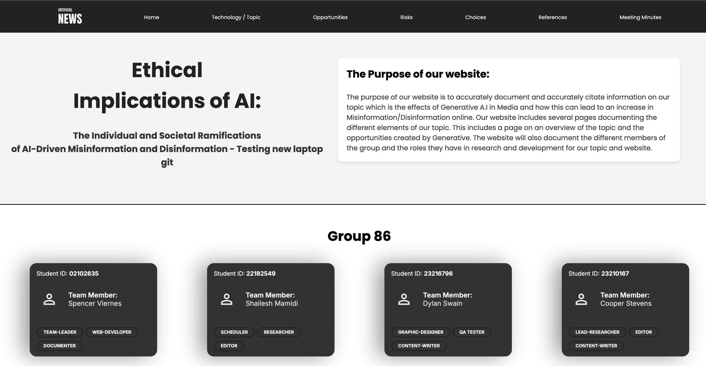
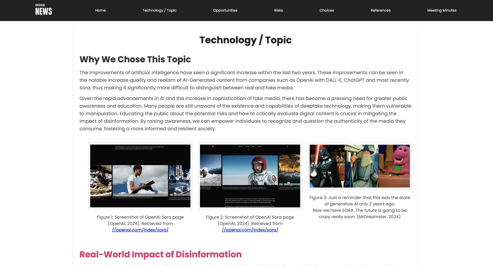
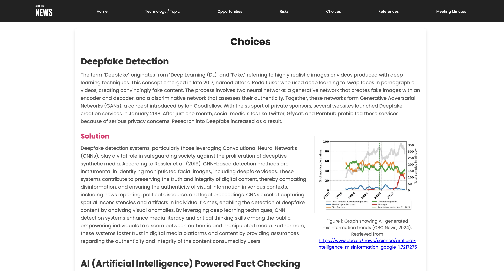
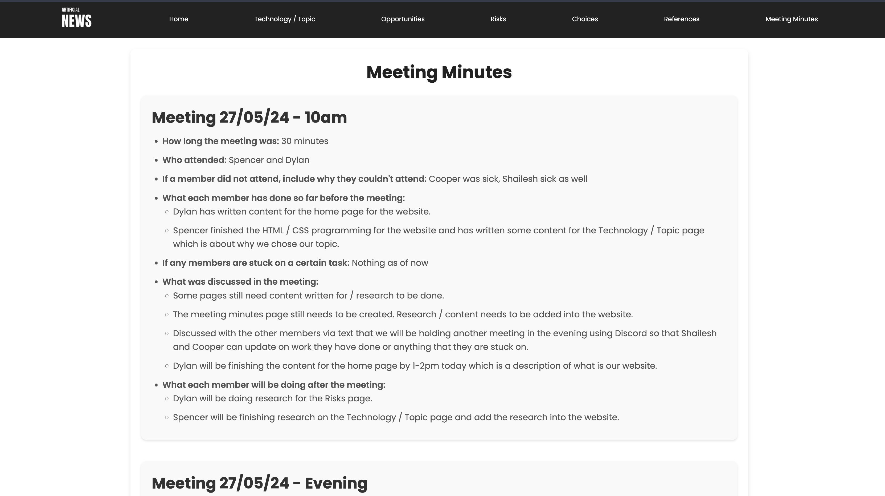
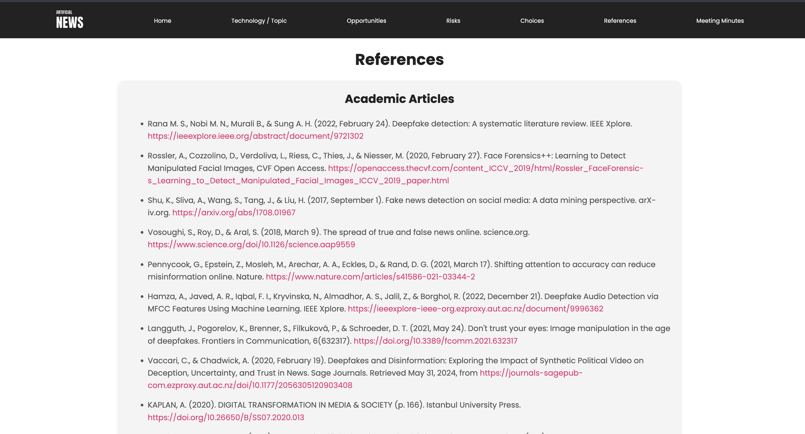

# Digital Truths

A first-year university web development project exploring the ethical and societal impact of AI-generated misinformation and disinformation.

## Project overview

This website was created as part of a first-year, first-semester assignment to research and present the ways in which artificial intelligence can be used to generate realistic but false media content. The project focuses on how AI can influence public trust, spread manipulated information, and create digital deception across online platforms.

The site aims to raise awareness about the dangers of misinformation while presenting the topic in an academic, structured, and accessible format.

## Project highlights

- Research-based website about AI, deepfakes, and digital trust
- Multi-page structure with a consistent navigation system
- Combination of academic content and web design
- Discussion of risks, opportunities, and ethical decision-making
- Built using foundational HTML and CSS techniques

## Website pages

The project includes the following pages:

- Home
- Technology / Topic
- Opportunities
- Risks
- Choices
- References
- Meeting Minutes

Each page contributes to the overall argument and helps present the assignment in a clear, student-friendly format.

A few key screenshots from the site are included below to demonstrate the layout and content:

- Homepage: 
- Topic page: 
- Choices page: 
- Meeting minutes page: 
- References page: 

## Skills used

- HTML structure and semantic page layout
- CSS styling and responsive presentation
- Multi-page website design
- Research and content organisation
- Project documentation and README writing

## Tech stack

This project uses a simple static website structure:

- HTML
- CSS
- Local image assets

No frameworks or build tools were required, which makes the project easy to open and run locally.

## How to run locally

### Option 1: Open directly

Open `index.html` in a browser.

### Option 2: Run a local server

From the project folder, run:

```bash
python3 -m http.server 8000
```

Then visit:

```text
http://localhost:8000
```

## Project structure

```text
.
├── index.html
├── technology.html
├── opportunity.html
├── risks.html
├── choices.html
├── references.html
├── meeting.html
├── styles.css
├── Images/
├── screenshots/
├── README.md
└── .git/
```

## Summary

This assignment highlights how AI is transforming media and why that matters. The website presents the argument that while AI can be useful, it also introduces serious risks when used to manipulate information and influence public perception.
